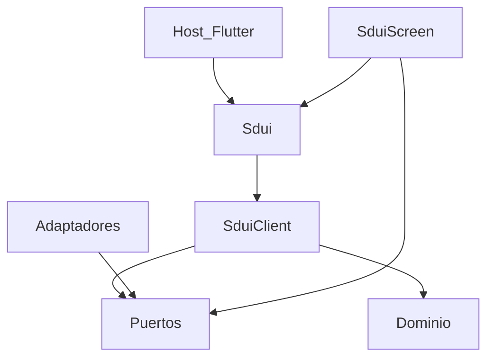
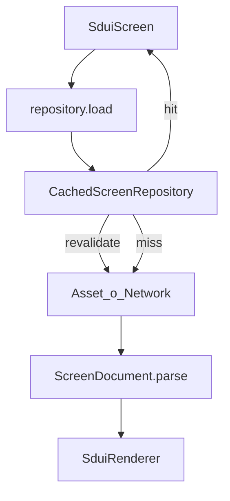

# Arquitectura

`sdui_client` es un cliente hexagonal: puertos hacia adentro, adaptadores (HTTP, assets, Stac) hacia afuera. No hay contenedor de DI. El composition root es `SduiClient.bootstrap`; `Sdui` es una fachada estática para hosts que llaman `Sdui.initialize`.

## Capas



| Capa | Ruta | Depende de |
|------|------|------------|
| Fachada | `sdui.dart` | `SduiClient` |
| Composición | `sdui_client.dart` | config, puertos, adaptadores |
| Puertos | `ports/`, `auth/token_store.dart`, `data/screen_cache.dart` | dominio |
| Dominio | `domain/` | nada de Flutter |
| Datos | `data/` | puertos + dominio + config |
| Render | `rendering/` | `SduiRenderer` + dominio; único import de `package:stac` |
| Presentación | `presentation/` | puertos + dominio + fachada |
| Acciones | `actions/` | `stac_framework` + callbacks del host |
| Rutas | `routing/` | helpers de path, sin `GoRouter` |

`StacRenderer` **no** se exporta en el barrel. Los hosts usan `SduiRenderer`.

## Bootstrap

`Sdui.initialize` asigna `_client = await SduiClient.bootstrap(...)`.

1. Observer: argumento → `config.observer` → `NoOpSduiObserver`.
2. Dio: `config.dio` o uno nuevo con `baseUrl`, `Accept: application/json` y `X-SDUI-Client-Version: 1`.
3. Si hay `tokenStore`, se añade `SduiAuthInterceptor` (`Authorization: Bearer` y `onUnauthorized` en HTTP 401).
4. Repositorio: `config.screenRepository` o el default según `source` (`AssetScreenRepository` / `NetworkScreenRepository`). Si `cacheScreens` (default `true`), se envuelve en `CachedScreenRepository`. Un repositorio inyectado **no** se envuelve.
5. Renderer: argumento o `StacRenderer`.
6. Si no hay renderer custom, `StacRenderer.bootstrap` registra Dio, `sduiNavigate`, `sduiLogout`, los parsers extra del host y, después, `sduiShare`, `sduiReload` y `barChart` (`override: true`).

Stac aplica `override: true`: el último parser de un mismo `type` o `actionType` reemplaza al anterior. `sduiShare`, `barChart` y `sduiReload` van al final para que un parser extra del host no los tape. `sduiNavigate` y `sduiLogout` siguen delante de los extra.

Sin `onNavigateScreen`, el parser de `sduiNavigate` lanza `StateError` al ejecutarse.

`sduiReload` llama a `ScreenRepository.loadFresh`. El decorator de cache no devuelve el hit: pide la pantalla, sustituye la entrada y avisa a `watch`. Si el GET falla, `SduiScreen` conserva el body que ya tenía y el observer recibe `onScreenError`. El future de la acción termina igual, con un `Response` vacío, para que el `RefreshIndicator` de Stac no se quede girando ni reemplace el hijo.

## Contrato de pantalla

`ScreenDocument.parse` acepta dos formas:

1. **Stac crudo** — raíz con `type`. Se trata como `schemaVersion` 0 (assets / snapshots de Core).
2. **Envelope** — `{ "schemaVersion": 1, "name": "home", "body": { "type": "scaffold", ... } }`. La API HTTP envuelve el árbol de Core así.

```json
{
  "schemaVersion": 1,
  "name": "home",
  "body": { "type": "scaffold", "body": { "type": "text", "data": "Hello" } }
}
```

`schemaVersion` mayor que `ScreenDocument.currentSchemaVersion` (1) lanza `SduiUnsupportedVersionException`. El body debe ser un objeto Stac (`type` string).

## Flujo de carga



1. `SduiScreen(name)` llama `repository.load` y, si el repo es `ScreenChangeSource`, se suscribe a `watch`.
2. **Cache hit:** se pinta al instante. Si la entrada no está dentro de `staleAfter` (o `staleAfter` es `null`), se revalida en background.
3. **Miss:** fetch con deduplicación in-flight. `NetworkScreenRepository` envía `If-None-Match`; HTTP 304 = conservar cache.
4. El documento llega a `SduiRenderer.render` → `Stac.fromJson(document.body)`. Si el renderer devuelve `null` o lanza, `SduiScreen` muestra el fallback de `SduiViewPolicy`.

Errores de revalidación SWR se tragan: el contenido stale sigue en pantalla.

## Auth y acciones

| Evento | Quién | Qué debe hacer el host |
|--------|-------|------------------------|
| Request HTTP | `SduiAuthInterceptor` | Nada: lee `TokenStore` y pone Bearer |
| HTTP 401 | `onUnauthorized` | Solo limpiar sesión local (no `POST` de revoke) |
| `sduiLogout` | `onLogout` | `POST /auth/logout` (o equivalente) **y luego** `tokenStore.clear` |
| `sduiNavigate` | `onNavigateScreen` | Navegar a `SduiRoutes.screen(name)` (`/sdui/{name}`) |
| `sduiShare` | — | Abre la hoja del sistema con el `text` del JSON |
| `sduiReload` | — | `loadFresh` de la pantalla nombrada, o de la que está en foco |

La librería no escribe tokens ni llama APIs de logout. El mismo Dio se comparte con Stac para que `networkRequest` relativos (`/sdui/actions/profile`) lleven auth.

Login y registro **no** viven en `SduiRoutes`.

## Errores

Jerarquía sellada (`SduiException`):

| Tipo | Cuándo |
|------|--------|
| `SduiLoadFailedException` | Fetch/parse: asset ausente, red, JSON inválido, 304 sin cache |
| `SduiUnsupportedVersionException` | `schemaVersion` > 1 |
| `SduiRenderFailedException` | El renderer no pudo pintar |

Carga y render se muestran con la misma UI de error/reintento de `SduiViewPolicy`. `SduiObserver.onScreenError` vs `onRenderFailed` los distinguen.

## Inventario público

Tipos exportados por `package:sdui_client/sdui_client.dart`:

| Tipo | Archivo | Rol |
|------|---------|-----|
| `Sdui` | `sdui.dart` | Fachada estática |
| `SduiClient` | `sdui_client.dart` | Runtime inyectable |
| `SduiConfig` / `SduiScreenSource` | `config.dart` | Knobs del host |
| `ScreenDocument` | `domain/screen_document.dart` | Contrato parseado |
| `SduiException` y subtipos | `domain/sdui_exception.dart` | Fallos tipados |
| `ScreenRepository` / `ScreenChangeSource` / `ConditionalScreenRepository` | `ports/screen_repository.dart` | Carga (y SWR / ETag) |
| `SduiRenderer` | `ports/sdui_renderer.dart` | JSON → widgets |
| `SduiObserver` / `NoOpSduiObserver` | `ports/sdui_observer.dart` | Diagnóstico |
| `AssetScreenRepository` | `data/asset_screen_repository.dart` | `assets/screens/{name}.json` |
| `NetworkScreenRepository` | `data/network_screen_repository.dart` | `GET {baseUrl}/sdui/screens/{name}` |
| `MemoryScreenRepository` | `data/memory_screen_repository.dart` | Tests y fakes |
| `CachedScreenRepository` | `data/cached_screen_repository.dart` | Decorator SWR |
| `ScreenCache` / `MemoryScreenCache` | `data/screen_cache.dart` | Persistencia del cache |
| `SduiScreen` / `DynamicScreen` | `presentation/sdui_screen.dart` | Widget de carga/render |
| `SduiViewPolicy` | `presentation/sdui_view_policy.dart` | Loading/error, copys, semántica |
| `TokenStore` / `MemoryTokenStore` | `auth/token_store.dart` | Bearer del host |
| `SduiNavigateActionParser` | `actions/sdui_navigate_action.dart` | `actionType: sduiNavigate` |
| `SduiLogoutActionParser` | `actions/sdui_logout_action.dart` | `actionType: sduiLogout` |
| `SduiShareActionParser` | `actions/sdui_share_action.dart` | `actionType: sduiShare` |
| `SduiReloadActionParser` | `actions/sdui_reload_action.dart` | `actionType: sduiReload` |
| `BarChartParser` / `BarChartView` | `widgets/bar_chart.dart` | `type: barChart` |
| `SduiRoutes` | `routing/sdui_routes.dart` | `/sdui/{name}` |

No exportados (detalle de implementación): `StacRenderer`, `SduiAuthInterceptor`, `asJsonObject`.

Defaults de config: `screenPath` = `/sdui/screens/{name}`, `assetPath` = `assets/screens/{name}.json`.

Motivación del diseño en [diseño](diseno.md). Guía práctica en [uso](uso.md).
