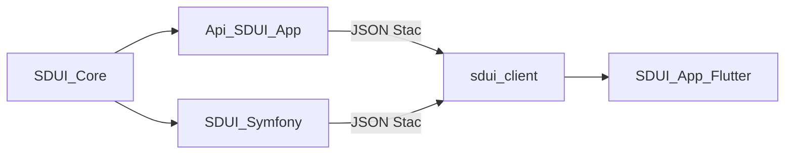

# Objetivos

`sdui_client` es el runtime Flutter compartido que carga pantallas Stac (assets o API), las versiona y las renderiza. No es una app: el host aporta login, router y almacenamiento seguro.

## Problema

El backend emite JSON Stac. Sin un cliente común, cada app Flutter reimplementaría carga, envelope de versión, cache HTTP, interceptor de auth y el wiring de Stac. Fácil de desincronizar con Core, difícil de testear y de reutilizar entre hosts.

## Objetivos

- **Runtime inyectable** (`SduiClient` / `Sdui.initialize`) con puertos para repositorio, renderer y observer.
- **Contrato dual estable**: árbol Stac crudo (`schemaVersion` 0) o envelope `{ schemaVersion, name, body }` (versión actual **1**). Versiones futuras fallan con `SduiUnsupportedVersionException` en lugar de un crash de Stac.
- **Stac detrás de un puerto.** El host usa `SduiRenderer`; `package:stac` queda aislado en un adaptador interno.
- **Auth y navegación del host.** `TokenStore`, `onLogout` y `onNavigateScreen` son callbacks. La librería no llama a `POST /auth/logout` ni posee rutas de login.
- **Cache SWR + ETag** por defecto en los repositorios asset/network.
- **Contrato con PHP Core** protegido con tests de parse (snapshots `home` / `details` / `form`) y goldens Stac de `home` y `details`.

## No-objetivos

Esto **no** forma parte del cliente; pertenece al host o a paquetes hermanos:

- UI de login/registro, `GoRouter` completo ni almacenamiento seguro del token.
- Catálogo HTTP de pantallas, cache de servidor, i18n del JSON ni mapeo de validación.
- Generar JSON Stac. Eso es SDUI-Core.
- Publicar en pub.dev. Hoy se consume por path (ver [instalación](instalacion.md)).

## Ecosistema

| Pieza | Rol |
|-------|-----|
| **SDUI-Core** | Builders PHP → JSON Stac |
| **Api-SDUI-App** | Host Laravel: envelope, rutas, Sanctum |
| **SDUI-Symfony** | Adaptador de formularios sobre Core |
| **sdui_client** | Carga, cache, contrato y render |
| **SDUI-App** | Host Flutter de referencia |

Ver [instalación](instalacion.md) para consumir el paquete y [uso](uso.md) para cablearlo.
